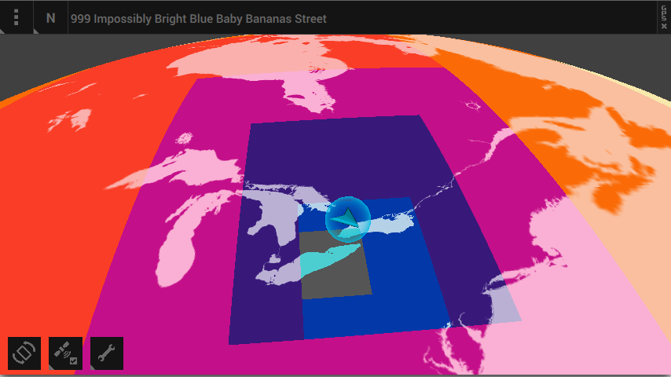
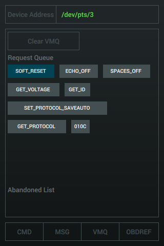
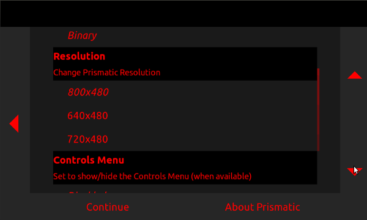
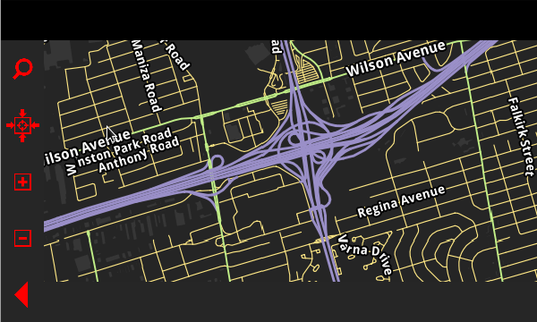

###Active Projects

***

####**ks**
*(C++11, Asio, Catch, GLM, SDL2, lodepng, FreeType, HarfBuzz, ICU, libunibreak)*
ks is a c++ library that can be used to help create applications and libraries. The core module has an implementation of signals and slots with event loops for event based programming inspired by the Qt framework. Additional modules provide platform event abstraction with SDL2, a simple OpenGL 2.1/OpenGL ES 2 wrapper, an Entity Component System, an interface to create and manage drawable objects, and unicode text rendering. ks has only been tested on Linux and Android so far, but the eventual goal is to have it working on all major desktop and mobile platforms.

[**Source Code**](https://github.com/preet?tab=repositories)

***

####**raintk**
*(C++11, ks, Clipper)*
raintk is a gui library for creating dynamic user interfaces. It is inspired by Qt's QtQuick/QML user interface library and has reactive widgets that can be automatically updated using property bindings.

[**Source Code**](https://github.com/preet/raintk)

***

####**obdex**
*(C++11, JavaScript, pugixml, duktape)*
obdex is a small library that is meant to act as a layer between on-board diagnostics ("OBD") interface software and higher level applications. It helps a developer build and parse messages required to communicate with a vehicle. An XML+JavaScript definitions file is used to define vehicle parameters, and can be easily extended to add support for additional parameters unique to different vehicles.

This library is a nearly identical to an older library I wrote called obdref with the only major difference being this version has no Qt dependency.

[**Source Code**](https://github.com/preet/obdex)

###Inactive Projects

****

####**prismatic**
*(C++, Qt4->Qt5, Boost, Android/JNI)*
prismatic is a general plugin-based front end that was created in response to some of the ideas and experiences I picked up working on front end software. It was used as a platform to create other applications and a base for an offline mapping application and a vehicle telemetry application.

####**prismatic / Unnamed Mapping Application**
A 3d mapping and navigation application based on data from the OpenStreetMap project. The application uses offline data so that maps are always available, even when a wireless or data connection isn't. The look and feel of the maps can be changed on the fly to allow for customization and improved accessibility (increased contrast, larger fonts, etc).

[Video 1 (running on desktop Linux)](http://youtu.be/yPMrE7MZBJY)
[Video 2 (older version running on a BlackBerry Playbook)](http://youtu.be/Z-pjugD2Olo)

****

####**quicksilver**
*(QtQuick 2,QML,GLSL)*
A set of flexible QtQuick user interface components written in QML to serve as the basis for a UI on mobile/touchscreen devices. Automatically scales UI components based on screen dimensions and resolution.

[Video 1 - quicksilver in motion](http://youtu.be/X6H89GfD2fs)

****

####**libelmif**
*(C++,Qt,QExtSerialPort, Android/JNI)*
libelmif is a library for communicating with OBD systems through ELM327-compatible devices. Currently supports USB/serial devices for Linux and bluetooth devices for Android.

****

####**libobdref**
*(C++, Qt, JavaScript, pugixml, duktape)*
libobdref is a small library that is meant to act as a layer between on-board diagnostics ("OBD") interface software and higher level applications. It helps a developer build and parse messages required to communicate with a vehicle. An XML+JavaScript definitions file is used to define vehicle parameters, and can be easily extended to add support for additional parameters unique to different vehicles. libobdref is open source and available [on my github](https://github.com/preet/libobdref)

****

####**libosmsrender**
*(C++,OpenSceneGraph,libosmscout,libjansson,OpenCTM)*
libosmsrender is a modular library that can be used to render map data in 3d. It uses OpenSceneGraph for rendering, and libosmscout as its primary (OpenStreetMap based) data provider, but these modules can be switched out for other back ends. The library uses a 'true 3d' coordinate system (ECEF), controls appearance via a JSON style description, and can combine datasets to create a detailed environment from multiple sources.

****

####**prismatic (old)**
*(C++,Qt4)*
More formalized attempt at creating an IVI front-end application to use in an in-car computer.

***

####**IVI Demo**
*(C++,Qt4)*
Demo created in my spare time at school. Basic music playback and telemetry over an ELM327 cable (OBD-II and Subaru Select Monitor).

[Video 1 - testing out music playback and reading vehicle parameters](http://youtu.be/24dYSASumpY)

